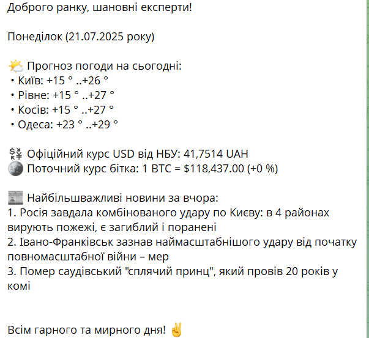
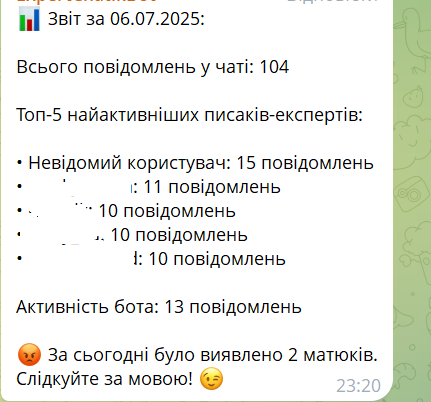
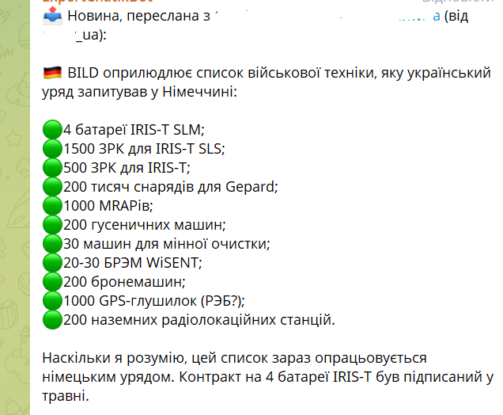
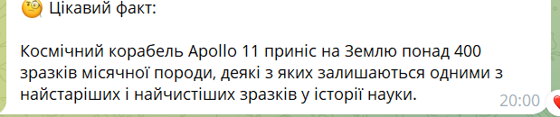
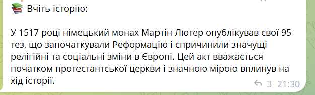
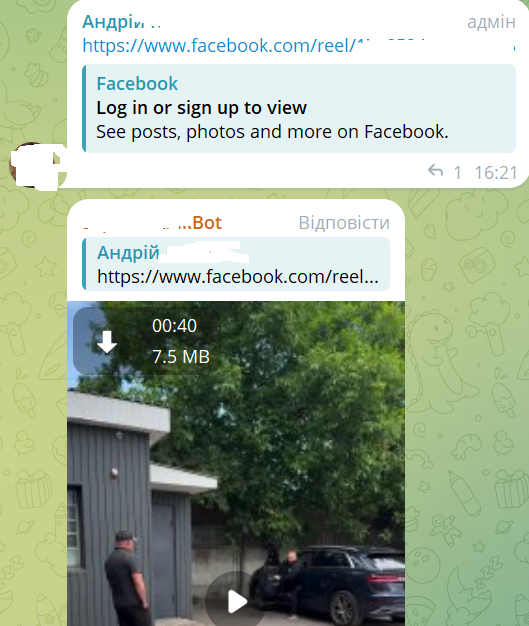
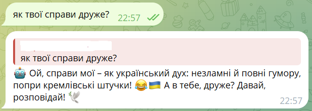

# 🧠 Telegram Bot - Асистент, Репортер і Завантажувач Відео із вбудованим ШІ

**Знавець Bot** - це багатофункціональний Telegram-бот, створений для автоматизації повсякденних задач у групових чатах. Він інтегрує штучний інтелект, розклад задач, аналіз активності учасників та зручну подачу інформації.

## **Опис етапів роботи:**

* починалось все як "вайбкодерський" проект, для тесту своїх можливостей під час вивчення Python. Хоча даний проект має мало спільного з Дата Аналітикою я все таки вирішив його довести до кінця;
* на 1 етапі я реалізував: Ранковий звіт з парсингом даних із сайтів Погоди, курсу долара, курсу біткоїна та новинного сайту. Дальше так само було реалізовано вечірній звіт, що підраховує кількість повідомлень в чаті за день та топ-5 найактивніших користувачів. Плюс добавив хмару слів;
* на 2 етапі я вирішив реалізувати функцію, що була уже в чат-бота, що є в багатьох чатах - витягування і загрузка відео із соцмереж (тік-ток, інстаграм, фейсбук). Реалізував за допомогою RapidAPI;
* на 3 етапі я вирішив інтегрувати штучний інтелект в роботу бота. За допомогою Open AI я доробив такі функції для бота як: експертна відповідь на будь-яке запитання при його згадуванні, відповідь на повідомлення при реплаях із збереженням контекту розмови. Дальше зробив Стистий Огляд Дня, тобто ШІ аналізував всі повідомлення за день та надав короткий огляд, що обговорювалось. Додатково добавив генерацію рендомних Цікавих фактів з будь-якої галузі і Історичних фактів для розумового навантаження в чаті;
* на 4 етапі доробив Переклад новин. Будь-який користувач може надсилати новину в приватні повідомлення боту і він надсилає переклад новини із збереженням контенту типу Фото чи Відео;
* на 5 етапі вже дороблялись кілька дрібних цікавих функцій - типу Лічильника матюків, планувальника анонсів, нагадування про кешбек чи оплату інтернету;
* планувальник вивів в окремий процес, реалізував ідекомпонентність в коді, добавив ручні ендпоїнти.

> Створено як pet-проєкт для практики з Python, API, базами даних та деплоєм у хмару.&#x20;

---

## ✨ Основні можливості

| Функція                   | Опис                                                                                                            |   |
| ------------------------- | --------------------------------------------------------------------------------------------------------------- | - |
| 📊 **Щоденний звіт**      | Статистика активності чату, топ-5 користувачів, кількість матюків, WordCloud                                    |   |
| 🌅 **Ранковий звіт**      | Погода, курс USD, BTC, топ-новини за вчора                                                                      |   |
| 💬 **OpenAI**             | Генерація експертних відповідей, переклади, стислий огляд чату за день, випадкові факти, цікаві історичні факти |   |
| 📰 **Переклад новин**     | Автоматичне отримання новин з українських та іноземних джерел, переклад їх українською та публікація у чаті     |   |
| 🎥 **Завантаження відео** | Підтримка TikTok, Instagram, Facebook через RapidAPI                                                            |   |
| ⌚ **Планування анонсів**  | Відправка запланованих повідомлень                                                                              |   |
| 🙌 **Антимат**            | Виявлення та підрахунок нецензурних слів у чаті                                                                 |   |
| 🎞 **Нагадування**        | Про кешбек (1-го числа) та оплати інтернету тощо (останнього дня місяця)                                        |   |

---

## 📖 Технології

* Python 3.10+
* Flask (Webhook сервер)
* PostgreSQL (через `psycopg2`)
* Telegram Bot API (`pyTelegramBotAPI`)
* OpenAI API (GPT-4.1-nano)
* RapidAPI (для завантаження відео)
* BeautifulSoup + requests (web scraping)
* `schedule` для планувальника
* WordCloud + Matplotlib (візуалізації)

---

## 📂 Структура проєкту

```
.
├── main.py                  # Основна логіка бота (обробка, API, бази, OpenAI)
├── scheduler_process.py     # Окремий процес для планувальника задач
├── requirements.txt         # Залежності
├── .env.example             # Зразок конфігу
```

---

## 🛠️ Приклади реалізованих функцій

Цей розділ демонструє ключові функціональні можливості бота, реалізовані в коді.

### **1. Збереження повідомлень у базу даних**

Опис функції:

Ця функція відповідає за збереження всіх вхідних та вихідних повідомлень (як від користувачів, так і від бота) у базу даних PostgreSQL. Вона забезпечує збереження message\_id Телеграму для уникнення дублікатів та дозволяє відстежувати активність чату, включаючи тип повідомлення бота.

```
    def save_message(self, telegram_message_id, user_id, username, message_content, message_date, chat_id_to_save, is_bot_message=False, bot_message_type=None):
        """
        Saves message information to the database.
        Now uses 'telegram_message_id' for mapping to Telegram messages.
        """
        conn = self._get_connection()
        if not conn:
            logging.warning(f"[{datetime.now()}] DB: save_message did not get DB connection. Message not saved.")
            return

        cur = None
        try:
            cur = conn.cursor()
            message_content_str = str(message_content) if message_content is not None else 'No content'

            logging.info(f"[{datetime.now()}] DB: Attempting to save message (Bot: {is_bot_message}, Type: {bot_message_type}) from User ID: {user_id}, Username: {username}, Chat ID: {chat_id_to_save}, Text: '{message_content_str[:50]}'")

            cur.execute(
                """INSERT INTO messages (telegram_message_id, user_id, username, message, timestamp, is_bot, chat_id, bot_message_type)
                   VALUES (%s, %s, %s, %s, %s, %s, %s, %s)
                   ON CONFLICT (telegram_message_id) DO UPDATE SET
                       user_id = EXCLUDED.user_id,
                       username = EXCLUDED.username,
                       message = EXCLUDED.message,
                       timestamp = EXCLUDED.timestamp,
                       is_bot = EXCLUDED.is_bot,
                       chat_id = EXCLUDED.chat_id,
                       bot_message_type = EXCLUDED.bot_message_type;""",
                (telegram_message_id, user_id, username, message_content_str, message_date, is_bot_message, chat_id_to_save, bot_message_type)
            )
            conn.commit()
            logging.info(f"[{datetime.now()}] DB: Message from User ID: {user_id} (Bot: {is_bot_message}, Type: {bot_message_type}) successfully saved to DB (Telegram ID: {telegram_message_id}).")

        except psycopg2.errors.UniqueViolation as e:
            logging.warning(f"[{datetime.now()}] DB: UniqueViolation (duplicate telegram_message_id) suppressed in save_message: {e}. Message Telegram ID: {telegram_message_id}")
            if conn: conn.rollback()
        except psycopg2.Error as e:
            logging.error(f"[{datetime.now()}] DB: Error saving message to DB (psycopg2): {e}", exc_info=True)
            if conn: conn.rollback()
        except Exception as e:
            logging.error(f"[{datetime.now()}] DB: Unexpected error in save_message: {e}", exc_info=True)
            if conn: conn.rollback()
        finally:
            if cur: cur.close()


```

### **2. Генерація щоденного ранкового звіту**

Опис функції:

Ця функція збирає актуальну інформацію про погоду, курси валют (USD, Bitcoin) та топ-3 новини з українських джерел. Вона форматує ці дані у стислий звіт, який потім надсилається до визначеного групового чату.

```
def generate_morning_report_text():
    """Generates the text content of the morning report."""
    now = datetime.now()
    weekday_ua = {
        "Monday": "Понеділок", "Tuesday": "Вівторок", "Wednesday": "Середа",
        "Thursday": "Четвер", "Friday": "П’ятниця", "Saturday": "Субота", "Sunday": "Неділя"
    }
    day = weekday_ua.get(now.strftime("%A"), now.strftime("%A"))
    date_str = now.strftime("%d.%m.%Y")

    report = (
        f"**Доброго ранку, шановні експерти\!**\n\n"
        f"**{escape_markdown_v2(day)} \\({escape_markdown_v2(date_str)}\\ року\\)**\n\n"
        f"{news_weather_service.get_daily_weather_report()}\n"
        f"{news_weather_service.get_official_usd_rate()}\n"
        f"{news_weather_service.get_bitcoin_price()}\n\n"
        f"{news_weather_service.get_top3_news_pravda()}\n\n"
        f"Всім гарного та мирного дня\! \U0000270C\ufe0f"
    )
    return report

def _send_morning_report_content(chat_id):
    """Generates and sends the morning report content."""
    logging.info(f"[{datetime.now()}] Report: Generating and sending morning report content.")
    try:
        report_text = generate_morning_report_text()
        telegram_sender.send_and_save_message(chat_id, report_text, parse_mode="MarkdownV2", bot_message_type='daily_report')
        logging.info(f"[{datetime.now()}] Report: Morning report content sent.")
    except Exception as e:
        logging.error(f"[{datetime.now()}] Report: Error generating/sending morning report content: {e}", exc_info=True)
        bot_response = f"Виникла помилка при створенні ранкового звіту\\: {escape_markdown_v2(str(e))}"
        telegram_sender.send_and_save_message(chat_id, bot_response, parse_mode="MarkdownV2", bot_message_type='report_error')


```

### **3. Генерація експертної відповіді від ШІ з контекстом**

Опис функції:

Ця функція використовує OpenAI API для генерації "експертних" відповідей на запитання користувачів. Вона здатна підтримувати контекст розмови, витягуючи останні повідомлення з бази даних, і відповідає у випадково обраній ролі (наприклад, історика, футуролога, філософа), додаючи унікальний тон до відповіді.

```
    def get_expert_answer(self, chat_id, current_query_text):
        """Generates an expert answer with conversation context using OpenAI, with a random role."""
        logging.info(f"[{datetime.now()}] OpenAI: Generating expert answer for chat {chat_id}: '{current_query_text[:50]}...'")

        random_role_prompt = random.choice(self.expert_roles)

        dynamic_expert_system_prompt = f"""
{random_role_prompt}

Твоя відповідь має бути короткою і лаконічною, не перевищуючи 180 токенів.
Завжди давай фактично коректну інформацію. Додай у відповідь тон, який відповідає обраній ролі.
Будь ласка, НЕ починай відповідь з фраз типу "Ось експертна думка з цього питання:", "Моя думка:", "Відповідь:" тощо. Одразу переходь до суті питання.
"""
        dynamic_expert_system_prompt = dynamic_expert_system_prompt.strip()

        raw_history = db_manager.get_recent_messages_for_context(chat_id, limit=10)
        messages_for_openai = [{"role": "system", "content": dynamic_expert_system_prompt}]
        for msg_entry in raw_history:
            messages_for_openai.append({"role": msg_entry["role"], "content": msg_entry["content"]})


        messages_for_openai.append({"role": "user", "content": current_query_text})

        try:
            response = self.client.chat.completions.create(
                model="gpt-4.1-nano",
                messages=messages_for_openai,
                max_tokens=180,
                temperature=0.8
            )
            expert_answer = response.choices[0].message.content
            logging.info(f"[{datetime.now()}] OpenAI: Expert answer successfully generated.")
            return expert_answer
        except openai.APIError as e:
            logging.error(f"[{datetime.now()}] OpenAI: API Error during expert answer generation: {e}", exc_info=True)
            return f"Expert on break. Questions too complex. Reason: {e}. Try simplifying, if you can."
        except Exception as e:
            logging.error(f"[{datetime.now()}] OpenAI: Unexpected error during expert answer generation: {e}", exc_info=True)
            return f"Something went wrong getting expert opinion. Perhaps your question was too silly for me. Reason: {e}."


```

### **4. Завантаження відео з соціальних мереж**

Опис функції:

Ця функція дозволяє завантажувати відео з популярних соціальних мереж (Facebook, Instagram, TikTok) за посиланням. Вона використовує зовнішній RapidAPI сервіс для обробки посилань та вибору відео найкращої якості, а потім надсилає його безпосередньо в чат Telegram.

```
def handle_social_media_link(chat_id, user_id, effective_message_content, telegram_message_id, chat_type): # Додано chat_type
    """Handles social media links for video download."""
    # Дозволити завантаження, якщо це груповий чат АБО це приватний чат І користувач є власником
    if chat_type in ['group', 'supergroup'] or (chat_type == 'private' and user_id == Config.OWNER_TELEGRAM_USER_ID):
        bot.send_chat_action(chat_id, "upload_video")
        result = social_downloader.download_video(effective_message_content.strip())
        if result and result.startswith("http"):
            try:
                video_resp = requests.get(result, stream=True, timeout=60)
                video_bytes = io.BytesIO()
                for chunk in video_resp.iter_content(chunk_size=8192):
                    video_bytes.write(chunk)
                video_bytes.seek(0)

                file_size_mb = video_bytes.tell() / (1024 * 1024)
                if file_size_mb > 50:
                    bot_response = f"Відео занадто велике \\({escape_markdown_v2(f'{file_size_mb:.2f}')} МБ\\), не можу відправити\\. Макс\\. 50 МБ\\."
                    telegram_sender.send_and_save_message(chat_id, bot_response, parse_mode="MarkdownV2", bot_message_type='video_too_large', telegram_message_id_to_reply=telegram_message_id)
                else:
                    video_bytes.name = "video.mp4"
                    # escaped_effective_message_content = escape_markdown_v2(effective_message_content) # Цей рядок більше не потрібен
                    telegram_sender.send_and_save_message(
                        chat_id, "", parse_mode="MarkdownV2", # Змінено: прибрано текст підпису
                        bot_message_type='video_upload', telegram_message_id_to_reply=telegram_message_id,
                        media_type='video', media_file=video_bytes
                    )

            except requests.exceptions.RequestException as e:
                bot_response = f"Не вдалося завантажити відео через помилку\\: {escape_markdown_v2(str(e))}\\. Перевірте посилання або спробуйте пізніше\\."
                telegram_sender.send_and_save_message(chat_id, bot_response, parse_mode="MarkdownV2", bot_message_type='video_download_error', telegram_message_id_to_reply=telegram_message_id)
            except Exception as e:
                bot_response = "Виникла несподівана помилка при обробці відео\\."
                telegram_sender.send_and_save_message(chat_id, bot_response, parse_mode="MarkdownV2", bot_message_type='video_processing_error', telegram_message_id_to_reply=telegram_message_id)
        else:
            bot_response = "Не вдалося обробити посилання на відео\\. Спробуйте інше\\."
            telegram_sender.send_and_save_message(chat_id, bot_response, parse_mode="MarkdownV2", bot_message_type='video_link_error', telegram_message_id_to_reply=telegram_message_id)
    else:
        # Повідомлення про відмову, якщо це приватний чат і користувач не є власником
        bot_response = "Вибачте, завантаження відео доступне лише в групових чатах або у приватному чаті власника бота, щоб заощадити кошти\\."
        telegram_sender.send_and_save_message(chat_id, bot_response, parse_mode="MarkdownV2", bot_message_type='permission_denied', telegram_message_id_to_reply=telegram_message_id)
        logging.info(f"[{datetime.now()}] Webhook: Video download rejected for non-owner in private chat.")


```

### **5. Переклад пересланих повідомлень**

Опис функції:

Ця функція дозволяє користувачам пересилати повідомлення з інших каналів або чатів у приватний чат з ботом. Бот автоматично перекладає текст пересланого повідомлення на українську мову за допомогою OpenAI API та публікує перекладену версію (з медіа, якщо є) у визначеному груповому чаті. Це дозволяє швидко ділитися новинами та інформацією з різних джерел.

```
def handle_forwarded_message(message_data, chat_id, telegram_message_id, effective_message_content):
    """Handles forwarded messages for translation."""
    raw_forward_from_chat_name = 'невідомого джерела' # Default value
    raw_username = message_data.get('from', {}).get('username', 'невідомого користувача')
    original_message_link = "" # Initialize link

    if 'forward_from_chat' in message_data:
        forward_from_chat = message_data['forward_from_chat']
        raw_forward_from_chat_name = forward_from_chat.get('title', 'приватного каналу/групи')
        if forward_from_chat.get('type') == 'channel':
            channel_username = forward_from_chat.get('username')
            original_msg_id = message_data.get('forward_from_message_id')
            if channel_username and original_msg_id:
                original_message_link = f"https://t.me/{channel_username}/{original_msg_id}"
                logging.info(f"[{datetime.now()}] Webhook: Знайдено посилання на оригінальне повідомлення: {original_message_link}")
    elif 'forward_from' in message_data:
        forward_from_user = message_data['forward_from']
        user_name_parts = []
        if 'first_name' in forward_from_user:
            user_name_parts.append(forward_from_user['first_name'])
        if 'last_name' in forward_from_user:
            user_name_parts.append(forward_from_user['last_name'])
        raw_forward_from_chat_name = 'від користувача ' + ' '.join(user_name_parts) if user_name_parts else 'від невідомого користувача'

    translated_text_from_ai = ""
    if effective_message_content:
        bot.send_chat_action(chat_id, "typing")
        try:
            translated_text_from_ai = openai_service.translate_text(effective_message_content)
        except Exception as e:
            logging.error(f"[{datetime.now()}] Webhook: Помилка перекладу пересланого вмісту: {e}", exc_info=True)
            translated_text_from_ai = f"Помилка перекладу: {e}"

    escaped_forward_from_chat_name = escape_markdown_v2(raw_forward_from_chat_name)
    escaped_username_for_display = escape_markdown_v2(raw_username)
    escaped_translated_text_from_ai_for_display = escape_markdown_v2(translated_text_from_ai)

    # Нова логіка для формування назви джерела з посиланням або без
    source_name_display = escaped_forward_from_chat_name
    if original_message_link:
        # Якщо є оригінальне посилання, вбудовуємо його в назву чату
        source_name_display = f"[{escaped_forward_from_chat_name}]({original_message_link})" # Змінено: прибрано escape_markdown_v2 для URL


    base_caption_content = (
        "\U0001F4E4 Новина, переслана з "
        f"{source_name_display} " # Використовуємо нову змінну тут
        f"\\(від {escaped_username_for_display}\\):\n\n"
        f"{escaped_translated_text_from_ai_for_display}"
    )

    # Рядок, що додавав "Оригінал новини" окремо, тепер не потрібен
    # if original_message_link:
    #     base_caption_content += f"\n\n[Оригінал новини]({escape_markdown_v2(original_message_link)})"

    MAX_CAPTION_LENGTH = 1024
    final_caption = base_caption_content
    if len(base_caption_content) > MAX_CAPTION_LENGTH - 3:
        final_caption = base_caption_content[:MAX_CAPTION_LENGTH - 3] + "..."
        logging.warning(f"[{datetime.now()}] Webhook: Truncated combined raw content to {MAX_CAPTION_LENGTH - 3} chars and added '...'.")

    content_sent = False

    if 'video' in message_data and message_data['video']:
        video_file_id = message_data['video']['file_id']
        logging.info(f"[{datetime.now()}] Webhook: Переслане повідомлення містить відео. File ID: {video_file_id}")
        try:
            telegram_sender.send_and_save_message(
                Config.GROUP_REPORT_CHAT_ID, final_caption, parse_mode="MarkdownV2",
                bot_message_type='news_forward_video',
                media_type='video', media_file=video_file_id
            )
            bot_response_private = f"\U0001F504 Переклад новини \\(з відео\\) відправлено у групу\\. Дякую\\!"
            telegram_sender.send_and_save_message(chat_id, bot_response_private, parse_mode="MarkdownV2", bot_message_type='translation_confirmation', telegram_message_id_to_reply=telegram_message_id)
            content_sent = True
        except Exception as e:
            logging.error(f"[{datetime.now()}] Webhook: Помилка надсилання пересланого відео з підписом: {e}", exc_info=True)
            error_msg = f"Ой, щось пішло не так при пересилці зображення з перекладом\\: {escape_markdown_v2(str(e))}\\. Спробуйте ще раз\\."
            telegram_sender.send_and_save_message(chat_id, error_msg, parse_mode="MarkdownV2", bot_message_type='translation_error', telegram_message_id_to_reply=telegram_message_id)

    elif 'photo' in message_data and message_data['photo'] and not content_sent:
        photo_file_id = None
        if isinstance(message_data['photo'], list) and message_data['photo']:
            photo_file_id = message_data['photo'][-1]['file_id']

        if photo_file_id:
            logging.info(f"[{datetime.now()}] Webhook: Переслане повідомлення містить фото. File ID: {photo_file_id}")
            try:
                telegram_sender.send_and_save_message(
                    Config.GROUP_REPORT_CHAT_ID, final_caption, parse_mode="MarkdownV2",
                    bot_message_type='news_forward_photo',
                    media_type='photo', media_file=photo_file_id
                )
                bot_response_private = f"\U0001F504 Переклад новини \\(з зображенням\\) відправлено у групу\\. Дякую\\!"
                telegram_sender.send_and_save_message(chat_id, bot_response_private, parse_mode="MarkdownV2", bot_message_type='translation_confirmation', telegram_message_id_to_reply=telegram_message_id)
                content_sent = True
            except Exception as e:
                logging.error(f"[{datetime.now()}] Webhook: Помилка надсилання пересланого фото з підписом: {e}", exc_info=True)
                error_msg = f"Ой, щось пішло не так при пересилці зображення з перекладом\\: {escape_markdown_v2(str(e))}\\. Спробуйте ще раз\\."
                telegram_sender.send_and_save_message(chat_id, error_msg, parse_mode="MarkdownV2", bot_message_type='translation_error', telegram_message_id_to_reply=telegram_message_id)

    elif effective_message_content and not content_sent:
        try:
            telegram_sender.send_and_save_message(
                Config.GROUP_REPORT_CHAT_ID, final_caption, parse_mode="MarkdownV2",
                bot_message_type='news_forward_text'
            )
            bot_response_private = f"\U0001F504 Переклад новини відправлено у групу\\. Дякую\\!"
            telegram_sender.send_and_save_message(chat_id, bot_response_private, parse_mode="MarkdownV2", bot_message_type='translation_confirmation', telegram_message_id_to_reply=telegram_message_id)
            logging.info(f"[{datetime.now()}] Webhook: Переслане повідомлення лише з текстом відправлено до групи {Config.GROUP_REPORT_CHAT_ID}.")
            content_sent = True
        except Exception as e:
            logging.error(f"[{datetime.now()}] Webhook: Помилка надсилання пересланого повідомлення лише з текстом: {e}", exc_info=True)
            error_msg = f"Ой, щось пішло не так при перекладі або відправці новини\\: {escape_markdown_v2(str(e))}\\. Спробуйте ще раз\\."
            telegram_sender.send_and_save_message(chat_id, error_msg, parse_mode="MarkdownV2", bot_message_type='translation_error', telegram_message_id_to_reply=telegram_message_id)

    elif not content_sent:
        logging.warning(f"[{datetime.now()}] Webhook: Отримано переслане повідомлення без тексту/підпису та без медіа. Ігноруємо.")
        bot_response_private = "Отримано переслане повідомлення без тексту та медіа\\. Нічого перекладати або пересилати\\."
        telegram_sender.send_and_save_message(chat_id, bot_response_private, parse_mode="MarkdownV2", bot_message_type='no_content_forward', telegram_message_id_to_reply=telegram_message_id)


```

### **6. Планування та відправка анонсів**

Опис функції:

Ця функція дозволяє планувати відправку текстових анонсів у груповий чат на майбутній час. Анонси зберігаються в базі даних і відправляються планувальником, коли настає зазначений час. Це зручно для нагадувань або важливих оголошень.

```
    def add_scheduled_announcement(self, chat_id, message_text, schedule_time_str):
        """Adds an announcement to the database for future scheduled sending."""
        conn = self._get_connection()
        if not conn:
            logging.warning(f"[{datetime.now()}] DB: No connection to add announcement.")
            return "Failed to connect to the database."

        cur = None
        try:
            cur = conn.cursor()
            try:
                hour, minute = map(int, schedule_time_str.split(':'))
                if not (0 <= hour <= 23 and 0 <= minute <= 59):
                    return "Incorrect time format. Use HH:MM (e.g., 18:00)."
            except ValueError:
                return "Incorrect time format. Use HH:MM (e.g., 18:00)."

            now_utc = datetime.utcnow()
            schedule_datetime_utc = datetime(now_utc.year, now_utc.month, now_utc.day, hour, minute, 0)
            if schedule_datetime_utc <= now_utc:
                schedule_datetime_utc += timedelta(days=1)

            # Екрануємо текст анонсу ПЕРЕД збереженням у БД, щоб він був безпечним для MarkdownV2 при відправці.
            escaped_message_text_for_db = escape_markdown_v2(message_text)

            cur.execute("""
                INSERT INTO scheduled_announcements (chat_id, message_text, schedule_datetime, sent)
                VALUES (%s, %s, %s, FALSE) RETURNING id;
            """, (chat_id, escaped_message_text_for_db, schedule_datetime_utc))
            new_id = cur.fetchone()[0]
            conn.commit()
            logging.info(f"[{datetime.now()}] DB: Announcement ID {new_id} scheduled for chat {chat_id} at {schedule_datetime_utc.strftime('%d.%m.%Y at %H:%M UTC')}.")
            return (
                f"Анонс заплановано на **{escape_markdown_v2(schedule_datetime_utc.strftime('%d.%m.%Y'))}** о "
                f"**{escape_markdown_v2(schedule_datetime_utc.strftime('%H:%M UTC'))}**\\. ID анонсу\\: `{escape_markdown_v2(str(new_id))}`"
            )
        except psycopg2.Error as e:
            logging.error(f"[{datetime.now()}] DB: Database error adding announcement: {e}", exc_info=True)
            return f"Помилка бази даних при плануванні анонсу: {escape_markdown_v2(str(e))}"
        except Exception as e:
            logging.error(f"[{datetime.now()}] DB: Несподівана помилка при плануванні анонсу: {e}", exc_info=True)
            return f"Несподівана помилка при плануванні анонсу: {escape_markdown_v2(str(e))}"
        finally:
            if cur: cur.close()

def job_send_scheduled_announcements():
    """Checks DB and sends scheduled announcements if due."""
    logging.info(f"[{datetime.now()}] Scheduler (main): Checking for scheduled announcements.")
    announcements_to_send = db_manager.get_scheduled_announcements_to_send()
    for ann_id, chat_id, message_text in announcements_to_send:
        try:
            # FIX: Removed double escaping. message_text is already escaped when saved to DB.
            bot_response = f"\U0001F4E2 **Анонс\\!**\n\n{message_text}"
            telegram_sender.send_and_save_message(chat_id, bot_response, parse_mode="MarkdownV2", bot_message_type='scheduled_announcement')
            db_manager.mark_announcement_sent(ann_id)
            logging.info(f"[{datetime.now()}] Scheduler (main): Announcement ID {ann_id} sent to chat {chat_id}.")
        except Exception as e:
            logging.error(f"[{datetime.now()}] Scheduler (main): Error sending announcement ID {ann_id}: {e}", exc_info=True)


```

---

## 📈 Приклади звітів

> 📎 Тут будуть додані скріншоти кожного типу звіту з прикладом. 

### 1. Ранковий звіт
[](docs/screenshots/Morning.png)

### 2. Щоденний звіт
[](docs/screenshots/Dailly.png)

### 3. Переклад новини
[](docs/screenshots/News.png)

### 4. Цікавий факт
[](docs/screenshots/Fact.png)

### 5. Історичний факт
[](docs/screenshots/History.png)

### 6. Відео із соцмереж
[](docs/screenshots/Video.png)

### 7. Експертна відповідь
[](docs/screenshots/Expert.png)

### ☁️ **Деплой на Fly.io**

Цей бот я розгорнув на платформі Fly.io, яка дозволяє запускати Python-застосунки в хмарі з окремими процесами.

Для деплою я виконав такі кроки:

### 🧱 **Docker і Webhook**

Створено власний Dockerfile, який встановлює всі залежності з requirements.txt, копіює код і запускає main.py - це Webhook сервер на Flask.

Webhook підключено через set_webhook Telegram API до домену, який автоматично видає Fly.io.

### ⚙️ **Планувальник як окремий процес**

Для щоденних і запланованих задач (ранковий звіт, вечірній, нагадування) я створив окремий файл scheduler_process.py.

Його запуск налаштовано як фоновий воркер-процес (в fly.toml) окремо від Flask.

### 🔐 **fly.toml**

Конфігураційний файл fly.toml містить:

налаштування порту та середовища,

вказівки на окремі процеси (web, worker)

### 🚀 **Деплой**

Останній крок - запуск:
```
flyctl deploy
```
Після чого бот самостійно запускається в хмарі 24/7, виконує всі заплановані задачі й приймає запити Telegram через webhook.


### 👤 **Автор**

**Ігор Грудзинський** - аналітик із бекграундом в економіці та любов'ю до автоматизації, даних та Python. Цей проєкт = приклад реальної реалізації бота з багатьма корисними функціями.

---

##
